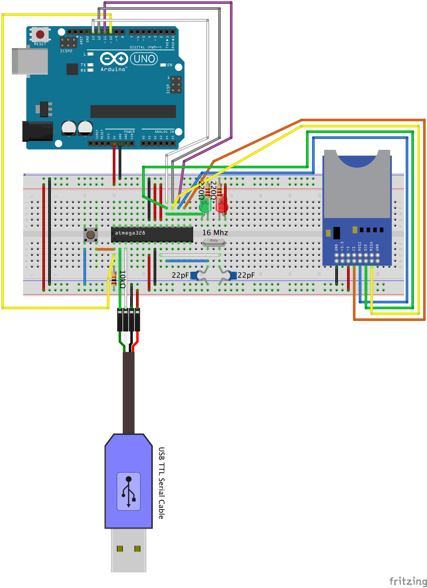

# ATMEGA328P UART SPI SDCard FAT32

Implement UART, SPI, SDCard, FAT32 on ATMEGA328P

# Connections

Configure the circuit as shown below. The reason I connected the Arduino was to program (Flash Write) to ATmega328P's Flash using `avrdude`.

# Description of the code

Please refer to the link below for an explanation of the code. It is written in Korean.

- [[AVR] ATmega328P UART 구현](https://kyuhyuk.kr/article/avr/2022/08/28/AVR-ATmega328P-UART)
- [[AVR] ATmega328P SPI 구현](https://kyuhyuk.kr/article/avr/2022/08/28/AVR-ATmega328P-SPI)
- [[AVR] ATmega328P SDCard 구현 (1)](https://kyuhyuk.kr/article/avr/2022/08/28/AVR-ATmega328P-SDCard-1)
- [[AVR] ATmega328P SDCard 구현 (2)](https://kyuhyuk.kr/article/avr/2022/09/01/AVR-ATmega328P-SDCard-2)
- [[AVR] ATmega328P SDCard 구현 (3)](https://kyuhyuk.kr/article/avr/2022/09/02/AVR-ATmega328P-SDCard-3)
- [[AVR] ATmega328P SDCard 구현 (4)](https://kyuhyuk.kr/article/avr/2022/09/03/AVR-ATmega328P-SDCard-4)
